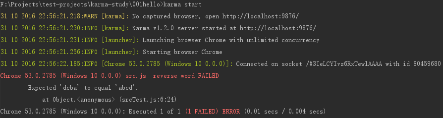
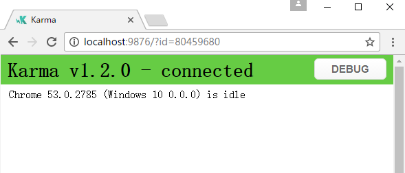

### karma hello
1. 命令行安装karma

    `npm install -g karma`
2. 启动karma测试服务服务（测试是否安装成功）

    `karma start`
3. ctrl+c 关闭karma服务

4. 初始化karma 配置文件

    `karma init`
    
    > 会有引导提示，tab键选择选项，所有选项可以回车默认
    ---
    > 完成后，会在当前目录生成 [karma.conf.js](karma.conf.js) 文件
    
    > 默认选项会依赖测试框架jasmine ，需要安装
        `npm install -g karma-jasmine`
        
    
5. 编写要测试的源文件 [src.js](src.js)

6. 编写测试逻辑的源文件 [srcTest.js](srcTest.js)
    > 示例使用jasmine的测试框架

7. 修改 [karma.conf.js](karma.conf.js) 文件
    
    `files: []` --- `files: ["*.js"]` [>>](karma.conf.js#L17)
    
    `exclude: []` --- `exclude: ["karma.conf.js"]`  [>>](karma.conf.js#L21)
8. 运行测试

    `karma start`
    
    > 默认选项会打开chrome调试运行测试代码，并回显chrome的控制台输出，返回测试结果
    
    ---
    
    
    